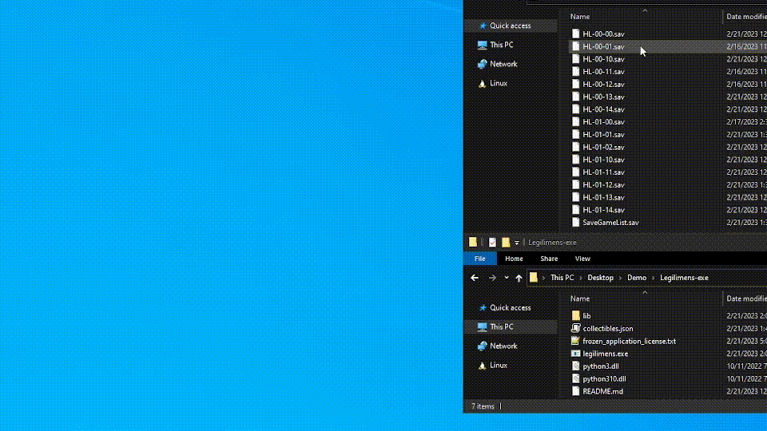
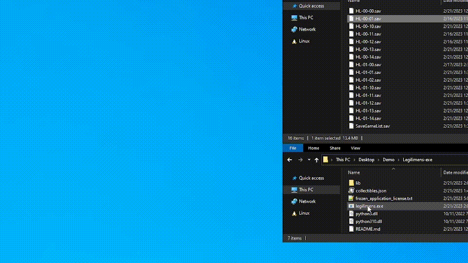
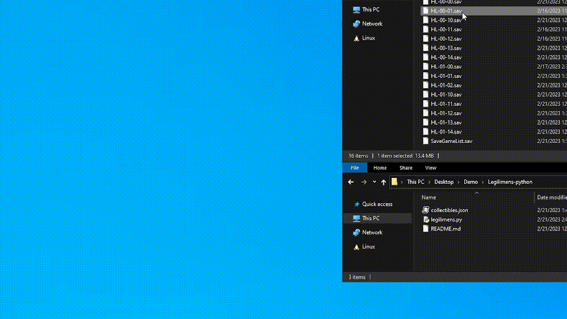

# Legilimens
Legilimens is a tool to help you find your last few missing collectibles in Hogwarts Legacy and finally get that 100% completion. All you need to do is run Legilimens with your save file, and it will analyze and return a list of every collectible that you're missing, including a link to a Youtube video with a timestamp showing its location. Legilimens does **not** edit your save file, it only reads the databases contained within it.

Legilimens has now been rewritten in C++ to allow for use as a completely standalone executable! Check it out [here](https://github.com/Malin001/Legilimens-Hogwarts-Legacy-cpp).

You can also find this tool on [Nexus](https://www.nexusmods.com/hogwartslegacy/mods/556).

#### What Legilimens can find:
- Field Guide Pages
- Collection Chests
- Demiguise Statues
- Vivarium Chests
- Butterfly Chests
- Daedalian Keys
- Merlin Trials
- Balloon Sets
- Landing Platforms
- Ancient Magic Hotspots
- Infamous Foes

#### What it *can't* find:
- Items that you are *required* to get during a quest. For example, there are two field guide pages that you are forced to pick up during the History of Magic class quest
- Collectible items that can be bought from vendors
- Collectible items that are rewards for completing quests

## Usage
Legilimens is available both as an executable file for convenience, and as a Python script for those wary of viruses so that you can actually see the code that you're running. Note that you can likely find your save files in `C:/Users/<user>/AppData/Local/HogwartsLegacy/Saved/SaveGames/<user_id>/`

#### How to use the executable:
1. Download and extract the latest [Legilimens executable release](https://github.com/Malin001/Legilimens-Hogwarts-Legacy-Collectible-Finder/releases/latest).
2. Either drag your `.sav` file onto `legilimens.exe`, or just run `legilimens.exe` and input the path to your `.sav` file when prompted.

#### How to use the Python script:
1. Install any version of [Python 3](https://www.python.org/downloads/). I've only tested it with Python 3.10, but it should work with earlier/later versions as well.
2. Download and extract the latest [Legilimens Python release](https://github.com/Malin001/Legilimens-Hogwarts-Legacy-Collectible-Finder/releases/latest). You should end up with `legilimens.py` and `collectibles.json` in the same folder.
3. Either drag your `.sav` file onto `legilimens.py`, or run the script with `python "<path>/<to>/legilimens.py" "<path>/<to>/<your>/<save>/<file>.sav"`, or just run `python "<path>/<to>/legilimens.py"` and input the path to your `.sav` file when prompted.

## FAQ
#### I have 33/34 Field Guide Pages in The Bell Tower Wing, but Legilimens says I've completed them all. Where is it?
- This is a known bug in Hogwarts Legacy that has since been patched, where a certain Bell Tower Wing [flying page](https://youtu.be/KnHZ5gVb_qk&t=104) doesn't count towards your total.
#### Legilimens says that I'm missing something that I've already collected, or doesn't detect all of my missing collectibles, or links to the wrong Youtube video/timestamp, or any other error.
- It's likely an error in my code, so open an [issue](https://github.com/Malin001/Legilimens-Hogwarts-Legacy-Collectible-Finder/issues) on GitHub, and attach your `.sav` file. I'll do my best to figure out what went wrong and fix it as soon as possible.

## Building your own executable
If you want the convenience of the executable release, while still knowing exactly what code it contains, you easily build it yourself:
1. [Download](https://github.com/Malin001/Legilimens-Hogwarts-Legacy-Collectible-Finder/archive/refs/heads/main.zip) the GitHub repository
2. Run `pip install cx_Freeze`
3. Run `python setup.py build`
4. The folder containing the executable and dependencies should now be located in `build/`

## Credit
A huge thank you to [100% Guides](https://www.youtube.com/@100Guides) on Youtube for making the majority of the videos that Legilimens links to, as well as [Game Guides Channel](https://www.youtube.com/@GameGuideslolz) and [ZaFrostPet](https://www.youtube.com/@ZaFrostPet), whose videos I used when 100% Guides' videos had errors.

Also thanks to [ekaomk](https://github.com/ekaomk/Hogwarts-Legacy-Save-Editor), whose Hogwarts Legacy Save Editor code I looked at to learn how to read the save files.
